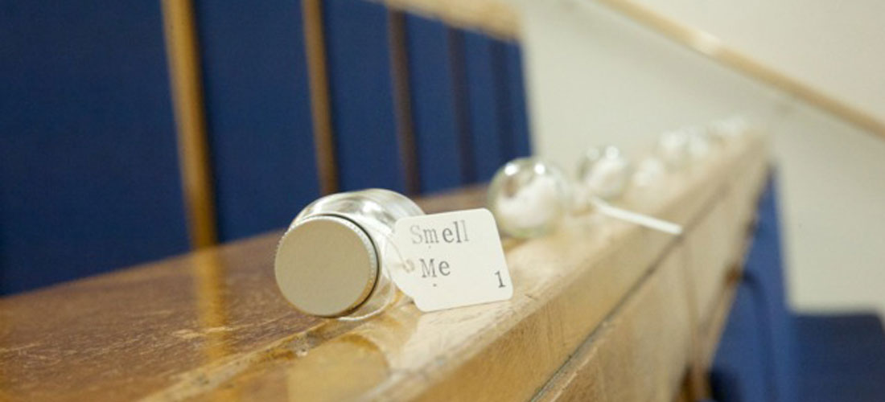

---

# CONFIGURATION
layout: 2013-spring
rootpath: "../../../"

# ABOUT THE SHOW - GENERIC
artist: "Plane Performance | Pigeon Theatre" # the name of the artist or company
show: "Three Sisters | The Smell of Envy" # the name of the show
artist_size: 3
show_size: 3
header_image: "header_pigeon_photo.jpg"

# ABOUT THE SHOW - LAYOUT
# artist_size: 1 # optional - size of artist name 1-5. Default is 1. Set longer names to lower values
# show_size: 2 # optional - size of show name 2-5. Default is 2. Set longer names to lower values
# header_image: "header.jpg" # optional custom background image, relative to current page

---
*Presented by* Word of Warning + Z-arts      

#### In Brief
A one-off chance to see a double bill of new works from two of Manchester's best-loved companies:    

**Plane Performance**'s very different take on Chekhov: three women with headset microphones say the words of three sisters in Russia, 100 years ago. But they are not those women and they know it. A simple premise that spirals out of control...    

**Pigeon Theatre** return in 3D smellovision with a performance lecture on memory and place, love and death, nostalgia and ageing, desire and envy – all conjured up by the neuroscience of smell.    
  
####Venue + Booking Details
Date: Friday 8 March 2013, 7.30pm (Double Bill)   
[Venue: Z-arts](http://www.z-arts.org/about-us/getting-here/), 335 Stretford Road, Manchester, M15 5ZA    
[Tickets: £8/5](http://www.z-arts.org/events/wow8mar/)    
Box Office Tel: 0161 232 6089     

   

##Plane Performance
####More
Three women talk at a table. Picked up via headset microphones, the words they say belong on the lips of three women trapped in a life of social decay and lost hope, in provincial Russia over 100 years ago. But they are not these women – they are not there, it is not then – and they know it. The conversation turns into a game, a free-flowing game of truth and dare, whilst the reality of the situation, and the presence of the audience, gradually shifts to the centre of their attention...    

*Three Sisters* is a hugely engaging re-presentation of Anton Chekhov’s play, a piece that is as much about its performance, its performers and its audience, as it is about three women trapped in provincial Russia, over 100 years ago.    
    
Harking back to Plane Performance’s *Re-placing Texts* trilogy, produced and toured between 2000 and 2005, *Three Sisters* blends technology and live performance in a hugely engaging theatrical experience – whether you know the original play or not.

####Who are they?
After a break of nearly seven years, *Three Sisters* marks the return of Plane Performance: returning to home territory but breaking new ground in the process. Once again directed by Neil Mackenzie, it features long time collaborator Niki Woods, Belgian theatre artist Leentje Van De Cruys and new performer Georgia Dawson.    

Plane Performance is an experimental theatre company formed in 1992. Concerned with the construction of contemporary theatre through the deconstruction of existing performance texts, more recently Plane Performance has also been involved in the production of other theatre events and festivals.  

Founding director, Neil Mackenzie (also Artistic Director of the Axis Arts Centre, Crewe and Flare International Festival of New Theatre), works in collaboration with a number of regular performers, most frequently Niki Woods, as well as other artistic associates. Based in Manchester, Plane Performance have performed widely in England as well as in Germany and Croatia.     

####What people have said about them    
Recent press for work by Neil Mackenzie:
>*Experimental, dangerous, funny and occasionally profound …precisely the stuff of which great fringe experiences are made* The Stage, on *Nicki Hobday Conquers Space*, directed by Neil Mackenzie.

####Credits         
Supported using public funding by Arts Council England, and by Manchester Metropolitan University.
          
####Website    
[www.planeperformance.co.uk](http://www.planeperformance.co.uk)    

##Pigeon Theatre
####More
A (lecture) theatre performance for those of you who love the smell of yesterday...   
   
What is the smell of desire? Of loathing, love and longing? The smell of death? The smell of envy and disappointment? What is the smell of childhood? The smell of your mother's house? The smell of your sexy French boyfriend? What is the smell of a telephone conversation with your dead father?    

*The Smell of Envy* investigates the neuroscience of smell, memory and place in a collaboration between Pigeon Theatre and cognitive neuroscientist Dr Colin Lever. Using a smell-scape of familiar and unfamiliar smells and a company including older actors, this is a show about smell and memory, and place and love, and death and nostalgia, and ageing and desire, and loathing and envy.    
 
*Spring 1994: White musk (for men), the flat in the Elephant and Castle (smell no. 48).    
 Summer 1965: Potato peelings and soap, my mother’s kitchen (smell no. 217). 
 October 1956: Printer’s ink, the old house with the linoleum floor (smell no. 18).*    
 
Theatre that smells.    
  
####Who are they?
Pigeon Theatre is a Manchester and Leeds-based contemporary performance company, making and touring innovative theatre since 2001. Their work is experimental and interactive – using nontraditional spaces and unconventional social engagement to create shared intimacies with the audience.    
    
Anna Fenemore, Artistic Director + Performer, is a lecturer in Theatre and Performance at the School of Performance and Cultural Industries, University of Leeds, specialising in Practice-as-Research, physical performance, site-specific performance and contemporary devised performance. Anna also works as a performer for other contemporary performance companies and is also a solo artist.   

Gillian Knox, Deviser, Performer + Co-Producer, has worked as a performer with Pigeon Theatre since 2001.  A lecturer at LIPA and an associate lecturer at the University of Leeds, she has also worked with writer Mark Griffiths to direct *The Impossibility Club for Rookie Theatre* and with PickleHerring Theatre, as a workshop facilitator and performer/maker making site work around environmental themes.    
  
####Credits         
A collaboration with Cognitive Neuroscientist Dr Colin Lever at the University of Durham; an outcome of the Wellcome Trust-funded project *Site and Smell*; supported using public funding by Arts Council England, and by the University of Leeds and hÅb.

####Websites
[www.pigeontheatre.com](http://www.pigeontheatre.com)  
[@PigeonTheatre](http://twitter.com/PigeonTheatre)
